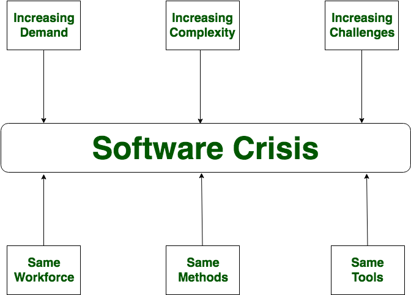
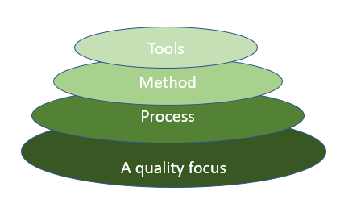
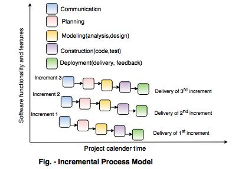
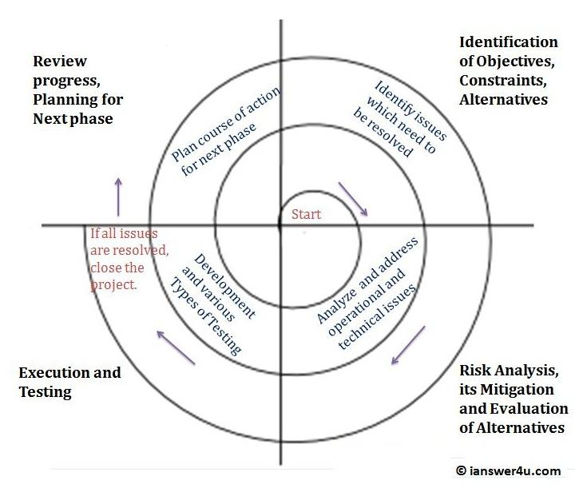

<html lang="en">
<head>
    <meta charset="UTF-8">
    <meta http-equiv="X-UA-Compatible" content="IE=edge">
    <meta name="viewport" content="width=device-width, initial-scale=1.0">
    <title>Home</title>
    <link rel="stylesheet" href="style.css"/>
  

</head>
<body>
   
<button onclick="topFunction()" id="myBtn" title="Go to top">Back to Top</button>
    <h1>Software Engineering</h1>
    
    

      <h2>Topics</h2>
      <ul>
    <li><a href="#software">1. Software</a></li>
    <li class="list"><a href="#process">The Process and the Product</a></li>
    <li class="list"><a href="#characteristics">Software  Characteristics</a></li>
    <li class="list"><a href="#characteristics">Software  Characteristics</a></li>
    <li class="list"><a href="#characteristics">Software  Characteristics</a></li>
    <li class="list"> <a href="#legacy">Legacy Software</a></li>
    <li class="list"><a href="#crisis">Software crisis</a></li>
    <li class="list"><a href="#myths">Software myths</a></li>
    <li ><a href="#softEngg">2. Software Engineering</a></li>
    <li class="list"><a href="#engg"> Software Engineering.</a></li>
    <li class="list"><a href="#layered"> A layered Technology</a></li>
    <li class="list"><a href="#framework"> Process Framework</a></li>
    <li><a href="#paradiagm">3. Paradigms </a></li>
    <li class="list"><a href="#sequential"> Sequential</a></li>
    <li class="list"><a href="#incremental"> Incremental </a></li>
    <li class="list"><a href="#evolution"> Evolutionary</a></li>
    <li class="list"><a href="#specialized">Specialized Process Models</a></li>
   </ul>
  

   <section id="software" class="software">
      

          <h3>Software</h3>
          <h4 style="text-align: center; font-size: 25px;color: brown;">Sub-Topics</h4>
         <ol>
             <li><a href="#process">The Process and the Product</a></li>
             <li><a href="#characteristics">Software  Characteristics</a></li>
             <li><a href="#legacy">Legacy Software</a></li>
             <li><a href="#crisis">Software crisis</a></li>
             <li><a href="#myths">Software myths</a></li>
          </ol>
          

            
Software Definition

            

                Software is: (1) instructions (computer programs) that when executed provide desired
    features, function, and performance; (2) data structures that enable the programs to adequately manipulate information, and (3) descriptive information in both hard copy and
    virtual forms that describes the operation and use of the programs.
    There is no question that other more complete definitions could be offere
            

            
Software Process

            

                A process is a collection of activities, actions, and tasks that are performed when
some work product is to be created. An activity strives to achieve a broad objective
(e.g., communication with stakeholders) and is applied regardless of the application
domain, size of the project, complexity of the effort, or degree of rigor with which
software engineering is to be applied. An action (e.g., architectural design) encompasses a set of tasks that produce a major work product (e.g., an architectural design
model). A task focuses on a small, but well-defined objective (e.g., conducting a unit
test) that produces a tangible outcome
            

            
FrameWork Activities

            

                For many software projects, framework activities are applied iteratively as a
project progresses. That is, communication, planning, modeling, construction,
and deployment are applied repeatedly through a number of project iterations.
Each project iteration produces a software increment that provides stakeholders with
a subset of overall software features and functionality. As each increment is produced, the software becomes more and more complete.
            

    
    
          

      

      
      
   </section>
   <section class="software">
    

        
Umbrella Activities

        

            Software engineering process framework activities are complemented by a number of umbrella activities. 
            In general, umbrella activities are applied throughout a software project and help a software team manage and 
            control progress, quality,
            change, and risk. Typical umbrella activities include: 
            1. <b>Software project tracking and control—</b>allows the software team to
            assess progress against the project plan and take any necessary action to
            maintain the schedule. 
            2. <b>Risk management—</b>assesses risks that may affect the outcome of the
            project or the quality of the product. 
            3.<b> Software quality assurance— </b>defines and conducts the activities required
            to ensure software quality. 
            4. <b>Technical reviews— </b>assesses software engineering work products in an effort
            to uncover and remove errors before they are propagated to the next activity. 
            5. <b> Measurement— </b>defines and collects process, project, and product measures
            that assist the team in delivering software that meets stakeholders’ needs;
            can be used in conjunction with all other framework and umbrella activities. 
            6. <b>Software configuration management— </b>manages the effects of change
            throughout the software process. 
            7.<b>Reusability management— </b>defines criteria for work product reuse
            (including software components) and establishes mechanisms to achieve
            reusable components. 
            8. <b>Work product preparation and production—</b>encompasses the activities
            required to create work products such as models, documents, logs, forms,
            and lists
                    

        
Software Product and Types of Software

        

           <b> Software Products </b>are nothing but software systems 
            delivered to the customer with the documentation 
            that describes how to install and use the system. In certain cases, software products may be part of 
            system products where hardware, as well as software, is delivered to a customer. Software products are 
            produced with the help of the software process. The software process is a way in which we produce software. 
        

        

           <b>Types of software products:</b>   
           Software products fall into two broad categories:  
          
        

    

   </section>
   <section id="characteristics" class="software">
     

      
 <b>1. Generic products:</b> 
        Generic products are stand-alone systems that are developed by a production unit and sold on the open market to any customer who is able to buy them.
         <b>2. Customized Products: </b>  
        Customized products are the systems that are commissioned by a particular customer. Some contractor develops the software for that customer.

        
Characteristics of a good software

        

            Every software must satisfy the following attributes: 
            Operational  
            Transitional  
            Maintenance

        

        

           <b>Operational</b> 
        This characteristic let us know about how well software works in the operations which can be measured on:
          1. Budget  
        2. Efficiency  
        3. Usability  
        4. Dependability  
        5. Correctness  
        6. Functionality  
        7. Safety  
        8. Security  
         
         <b>Transitional</b>
          This is an essential aspect when the software is moved from one platform to another:
           1.  Interoperability  
          2. Reusability  
          3. Portability  
          4. Adaptability  
           
                <b>Maintenance</b>
                  This aspect talks about how well software has the capabilities to adapt itself in the quickly changing environment:
                    1. Flexibility  
                  2. Maintainability  
                  3. Modularity  
                  4. Scalability  
             

     

   </section>
   <section class="software" id="legacy">
    

        
Legacy Software

        

            Legacy software is an older version of a program or application
             that still functions even after newer updates or versions are available.
              Companies typically use legacy software when they have older technology systems. 
              Older computers are often only compatible with software of a similar age, so
               it's easier for companies to use legacy software instead of purchasing new equipment.
        

          
 <b>Advantages of Legacy Software</b> 

        

          1.  Legacy softwares are familiar  
          2. Legacy softwares ensure continuity in the business operations 
          3. Legacy software replacement is painful.
        

        
  <b>Disadvantages of Legacy Software</b>

       
        

            1. Compatibility issues  
            2. Limited Flexibility 
            3. Functionality issue  
            4. Old interface  
            5. Costly Maintenance  
            6. Security Vulnerabilities
        

        

            
Software crisis

            

                Software Crisis is a term used in computer science for the difficulty of
                 writing useful and efficient computer programs in the required time. The
                  software crisis was due to using the same workforce, same methods, same 
                  tools even though rapidly increasing in software demand, the complexity 
               of software, and software challenges. With the increase in the complexity
              of software, many software problems arise because existing methods were
               insufficient. If we will use the same workforce, same methods, and same
               tools after the fast increase in software demand, software complexity,
               and software challenges, then there arise some problems like software 
               budget problems, software efficiency problems, software quality problems,
             software managing and delivering problem, etc. This condition is called a software crisis.
            

            <h4 style="margin-left: 10px;">Causes of Software Crisis</h4>
         

       

     </section>
   <section class="software">
    

        
        

        
1. The cost of owning and maintaining software was as expensive as developing the software 

        
2. At that time Projects were running over-time

        
3. At that time Software was very inefficient 

        
4. The quality of the software was low quality 

        
5. Software often did not meet user requirements

        
6. The average software project overshoots its schedule by half

        
7. At that time Software was never delivered

        
8. Non-optimal resource utilization.

        
9. Difficult to alter, debug, and enhance.

        
10. The software complexity is harder to change. 

    

    

        
Software Myths

        

          Software myths are erroneous beliefs about software and the process that is used to
          build it can be traced to the earliest days of computing. Myths have a number of
          attributes that make them insidious
        

        <h4 style="margin:10px ;"> Various types of Software myths: </h4>
       
    

    
    

    
    

   </section>
   <section class="software">
    

      

        1. <b>Management myths</b> Managers with software responsibility, like managers in
        most disciplines, are often under pressure to maintain budgets, keep schedules from
        slipping, and improve quality. Like a drowning person who grasps at a straw, a software
         manager often grasps at belief in a software myth, if that belief will lessen the
        pressure (even temporarily).
      

      

        <b >Myth: </b> &nbsp; &nbsp;
        We already have a book that's full of standards and procedures for
         building software. Won't that provide my people with everything they
        need to know?  
        <b>Reality: </b> &nbsp; &nbsp;
        The book of standards may very well exist, but is it used? Are software practitioners 
        aware of its existence? Does it reflect modern
       software engineering practice? Is it complete? Is it adaptable? Is it
       streamlined to improve time-to-delivery while still maintaining a
       focus on quality? In many cases, the answer to all of these questions
        is “no.” 
        <b>Myth: </b> &nbsp; &nbsp;
        If we get behind schedule, we can add more programmers and catch up
        (sometimes called the “Mongolian horde” concept) 
        <b>Reality: </b> &nbsp; &nbsp;
        Software development is not a mechanistic process like manufacturing. In the words of Brooks: 
        “adding people to a late software project makes it later.” At first, this statement may seem
       counterintuitive. However, as new people are added, people who
       were working must spend time educating the newcomers, thereby
       reducing the amount of time spent on productive development
       effort. People can be added but only in a planned and well coordinated manner. 
       <b>Myth: </b> &nbsp; &nbsp;
       If I decide to outsource the software project to a third party, I can just
        relax and let that firm build it. 
        <b>Reality: </b> &nbsp; &nbsp;
        If an organization does not understand how to manage and control
       software projects internally, it will invariably struggle when it outsources software projects.

      

      

        2. <b>Customer myths</b> &nbsp; &nbsp;
        A customer who requests computer software may be a person
       at the next desk, a technical group down the hall, the marketing/sales department,
      or an outside company that has requested software under contract. In many cases,
      the customer believes myths about software because software managers and practitioners do little to correct misinformation. 
      Myths lead to false expectations (by the
      customer) and, ultimately, dissatisfaction with the developer.
    

    

      <b>Myth: </b> &nbsp; &nbsp;
      A general statement of objectives is sufficient to begin writing
       programs i;e we can fill in the details later  
    

  

</section>
<section class="software">
  

    

      <b>Reality: </b> &nbsp; &nbsp;
      Although a comprehensive and stable statement of requirements is
      not always possible, an ambiguous “statement of objectives” is a
      recipe for disaster.. Unambiguous requirements are developed only through effective and continuous
      communication between customer and developer. 
      <b>Myth: </b> &nbsp; &nbsp;
      Software requirements continually change, but change can be easily
      accommodated because software is flexible. 
      <b>Reality: </b>   &nbsp; &nbsp;
      It is true that software requirements change, but the impact of
      change varies with the time at which it is introduced. When requirements changes are requested early (before design or code has been
      started), the cost impact is relatively small.16 However, as time
      passes, the cost impact grows rapidly—resources have been committed, a design framework has been established, and change can
      cause upheaval that requires additional resources and major design
      modification 
    

    

      3. <b>Practitioner's myths</b>&nbsp; &nbsp;
      Myths that are still believed by software practitioners have
      been fostered by over 50 years of programming culture. 
      During the early days, programming was viewed as an art form.
       Old ways and attitudes die hard.
        
       <b>Myth: </b>&nbsp;&nbsp;
       Once we write the program and get it to work, our job is done. 
       <b>Reality:</b>&nbsp;&nbsp;
       Someone once said that “the sooner you begin 'writing code,' the
       longer it'll take you to get done.” Industry data indicate that between
       60 and 80 percent of all effort expended on software will be expended
        after it is delivered to the customer for the first time.
         
        <b>Myth: </b>&nbsp;&nbsp;
        Until I get the program “running” I have no way of assessing its quality. 
       <b>Reality:</b>&nbsp;&nbsp;
       One of the most effective software quality assurance mechanisms
       can be applied from the inception of a project—the technical review.
       Software reviews (described in Chapter 15) are a “quality filter” that
       have been found to be more effective than testing for finding certain
       classes of software defects.
         
        <b>Myth: </b>&nbsp;&nbsp;
        The only deliverable work product for a successful project is the working
        program. 
       <b>Reality:</b>&nbsp;&nbsp;
       A working program is only one part of a software configuration that
       includes many elements. A variety of work products (e.g., models,
       documents, plans) provide a foundation for successful engineering
       and, more important, guidance for software support.
         
        <b>Myth: </b>&nbsp;&nbsp;
        Software engineering will make us create voluminous and unnecessary
        documentation and will invariably slow us down. 
       <b>Reality:</b>&nbsp;&nbsp;
       Software engineering is not about creating documents. It is about
       creating a quality product. Better quality leads to reduced rework.
       And reduced rework results in faster delivery times.
    

  

</section>
<section id="softEngg" class="software">
  

    <h3>Software Engineering</h3>
          <h4 style="text-align: center; font-size: 25px;color: brown;">Sub-Topics</h4>
         <ol>
             <li><a href="#engg">1. Software Engineering.</a></li>
             <li><a href="#layered">2. A layered Technology</a></li>
             <li><a href="#framework">3. Process Framework</a></li>
         </ol>
        

          
Software Engineering

          

            The IEEE  has developed a more comprehensive definition of software enhineering when it states:
                <b> Software Engineering:</b>  The application of a systematic, disciplined, quantifiable approach
            to the development, operation, and maintenance of software; that is, the application of
            engineering to software.  
            Software engineering is a layered technology.  any engineering approach
             (including software engineering) must rest on an organizational commitment to quality.
          

          
        

        

          

            A Layered Technology

            

              
            

        

      

</section>
<section class="software">
  

    

      <b>A quality focus:</b> 
      It defines the continuous process improvement principles of software. It provides
      integrity that means providing security to the software so that data can be accessed 
      by only an authorized person, no outsider can access the data. It also focuses on maintainability and usability.
      
     <b>Process  Layer:</b>
      The foundation for software engineering is the process layer. The software engineering process is
       the glue that holds the technology layers together and enables
      rational and timely development of computer software. Process defines a framework
      that must be established for effective delivery of software engineering technology.
      The software process forms the basis for management control of software projects
      and establishes the context in which technical methods are applied, work products
      (models, documents, data, reports, forms, etc.) are produced, milestones are established, quality is 
      ensured, and change is properly managed.  
      <b>Software engineering methods</b>  provide the technical how-to's for building software. Methods encompass a broad array of tasks that include communication,
      requirements analysis, design modeling, program construction, testing, and support. Software engineering methods rely on a set of basic principles that govern
      each area of the technology and include modeling activities and other descriptive
      techniques.  
      <b>Software engineering tools</b>     provide automated or semiautomated support for the
      process and the methods. When tools are integrated so that information created by
      one tool can be used by another, a system for the support of software development,
      called computer-aided software engineering, is established.
    

    

      

        Process Framework

        

          A process is a collection of activities, actions, and tasks that are performed when
          some work product is to be created.   
          <b>An activity</b> strives to achieve a broad objective
          (e.g., communication with stakeholders) and is applied regardless of the application
          domain, size of the project, complexity of the effort, or degree of rigor with which
          software engineering is to be applied.  
         <b>  An action</b> (e.g., architectural design) encompasses
           a set of tasks that produce a major work product (e.g., an architectural design
          model).  
          <b>A task </b>  focuses on a small, but well-defined objective (e.g., conducting a unit
          test) that produces a tangible outcome.
        

    

</section>
<section class="software">
  

    

      A process framework establishes the foundation for a complete software engineering process by
       identifying a small number of framework activities that are applicable to all software projects,
        regardless of their size or complexity. In addition, the
      process framework encompasses a set of umbrella activities that are applicable
      across the entire software process. A generic process framework for software engineering
       encompasses five activities:  
       <b>Communication </b> Before any technical work can commence, it is critically
       important to communicate and collaborate with the customer (and other
       stakeholders11 The intent is to understand stakeholder's objectives for the
       project and to gather requirements that help define software features and
       functions.  
       <b>Planning.</b> Any complicated journey can be simplified if a map exists. A
       software project is a complicated journey, and the planning activity creates a
       “map” that helps guide the team as it makes the journey. The map—called a
       software project plan—defines the software engineering work by describing
       the technical tasks to be conducted, the risks that are likely, the resources
       that will be required, the work products to be produced, and a work
       schedule.    
       <b>Modeling.</b>     Whether you're a landscaper, a bridge builder, an aeronautical
       engineer, a carpenter, or an architect, you work with models every day. You
       create a “sketch” of the thing so that you'll understand the big picture—what
       it will look like architecturally, how the constituent parts fit together, and
       many other characteristics. If required, you refine the sketch into greater and
       greater detail in an effort to better understand the problem and how you're
       going to solve it. A software engineer does the same thing by creating models to better 
       understand software requirements and the design that will
       achieve those requirements.   
       <b>Construction.</b>     This activity combines code generation (either manual or
       automated) and the testing that is required to uncover errors in the code.     
       <b>Deployment.</b>     The software (as a complete entity or as a partially completed increment) is delivered to the customer who evaluates the delivered
       product and provides feedback based on the evaluation.
    

    

         Software engineering process framework activities are complemented by a number of umbrella activities. In general, umbrella activities are applied 
         throughout a software project and help a software team manage and control progress, quality,
      change, and risk. Typical umbrella activities include:  
      Software project tracking and control, Risk management, 
      Software quality assurance,Technical reviews,Measurement,
      Software configuration management,Reusability management and
      Work product preparation and production.
    

  

</section>
<section class="software" id="paradiagm">
  

    <h3>Paradiagm</h3>
    <h4 style="text-align: center; font-size: 25px;color: brown;">Sub-Topics</h4>
   <ol>
       <li><a href="#sequential">1. Sequential</a></li>
       <li><a href="#incremental">2. Incremental </a></li>
       <li><a href="#evolution">3. Evolutionary</a></li>
       <li><a href="#specialized">4. Specialized Process Models</a></li>
   </ol>
   

      

     Sequential Waterfall model

      

      The waterfall model, sometimes called the classic life cycle, suggests a systematic,
      sequential approach  to software development that begins with customer specification of requirements and progresses through planning, modeling, construction, and
      deployment, culminating in ongoing support of the completed software . It is generally used 
      when requirements are reasonably well understood.
     <b> Advantage:</b>  
      It can serve as a useful process model in situations where requirements are fixed and work is to 
      proceed to complete in a linear manner.  
      
      
     

   

  

</section>
<section class="software">
  

    

      <b> Disadvantage:</b>  
      1. Real projects rarely follow the sequential flow that the model proposes. Although the linear model 
      can accommodate iteration, it does so indirectly. As a result, changes can cause confusion as the 
      project team proceeds.  
      2. It is often difficult for the customer to state all requirements explicitly. The waterfall model 
      requires this and has difficulty accommodating the natural uncertainty that exist at the beginning 
      of many projects.  
     3.  The customer must have patience. A working version of the programs will not be available until 
      late in the project time-span. If a major blunder is undetected then it can be disastrous until the 
      program is reviewed.  
      A variation in the representation of the waterfall model is called the V-model.  
       <b>V-model</b>  depicts the relationship of quality
       assurance actions to the actions associated with communication, modeling, and
       early construction activities. As a software team moves down the left side of the V,
       basic problem requirements are refined into progressively more detailed and technical 
       representations of the problem and its solution. Once code has been generated,
       the team moves up the right side of the V, essentially performing a series of tests
       (quality assurance actions) that validate each of the models created as the team
       moved down the left side. In reality, there is no fundamental difference between the
       classic life cycle and the V-model. The V-model provides a way of visualizing how
       verification and validation actions are applied to earlier engineering work.
        
       The waterfall model is the oldest paradigm for software engineering.
        
       
    

    

  </section>
               <section class="software">
                

                  

                    Incremental Process Models

                    

                      Incremental development is particularly useful when staffing is unavailable for a 
                      complete implementation by the business deadline that has been established for the project. Early 
                      increments can be implemented with fewer people. If the core product is well received, additional staff can 
                      be added to implement the next increment. In addition, increments can be planned to manage technical 
                      risks. 
                      The incremental model combines elements of the waterfall model applied in an iterative fashion.
                      The incremental model delivers a series of releases called increments that provide progressively 
                      more functionality for the customer as each increment is delivered. 
                      When an incremental model is used, the first increment is often a core product. That is, basic 
                      requirements are addressed. The core product is used by the customer. As a result, a plan is 
                      developed for the next increment. 
                      The plan addresses the modification of the core product to better meet the needs of the customer 
                      and the delivery of additional features and functionality.
                      This process is repeated following the delivery of each increment, until the complete product is 
                      produced. 
                      
                    

                  

               </section>
               <section class="software">
                  

                    

                      Evolutionary Process Models

                      

                        Evolutionary process models produce with each iteration produce an increasingly more complete version 
                        of the software with every iteration.
                        Evolutionary models are iterative. They are characterized in a manner that enables software engineers 
                        to develop increasingly more complete versions of the software.
                         
                         There are two common evolutionary process models.
                      

                      

                        <b>1.Prototyping : </b>   If a customer defines a set of general objectives for software, but does not identify detailed 
                        input, processing, or output requirements, in such situation prototyping paradigm is best approach.
                        If a developer may be unsure of the efficiency of an algorithm, the adaptability of an 
                        operating system then he can go for this prototyping method.
                             Although prototyping can be used as a stand-alone process model, it is more commonly used as a technique that can be implemented within the context of any one
                        of the process models noted in this chapter. Regardless of the manner in which it is
                        applied, the prototyping paradigm assists you and other stakeholders to better
                        understand what is to be built when requirements are fuzzy.
                      

                      

                        <b>2. THE SPIRAL MODEL </b>
                        The spiral model, originally proposed by Boehm, is an evolutionary software process model that 
                        couples the iterative nature of prototyping with the controlled and systematic aspects of the
                         waterfall model.
                        The spiral model can be adapted to apply throughout the entire life cycle of an application, from
                         concept development to maintenance.
                        Using the spiral model, software is developed in a series of evolutionary releases. During early
                        iterations, the release might be a paper model or prototype. During later iterations, increasingly 
                        morecomplete versions of the engineered system are produced.
                      
                     
                      

                     

               </section>
               <section class="software">
                  

                    

                      SPECIALIZED PROCESS MODELS

                    

                      Specialized process models take on many of the characteristics of one or more of the
                      traditional models presented in the preceding sections. However, these models tend
                      to be applied when a specialized or narrowly defined software engineering approach
                      is chosen.  
                      <b>1. Component-Based Development</b>  
                      Commercial off-the-shelf (COTS) software
                      components, developed by vendors who offer them as products, provide targeted
                      functionality with well-defined interfaces that enable the component to be integrated into
                      the software that is to be built. The component-based development model incorporates
                      many of the characteristics of the spiral model. It is evolutionary in nature, demanding an
                      iterative approach to the creation of software. However, the component-based
                      development model constructs applications from prepackaged software component.
                      Modeling and construction activities begin with the identification of candidate components.
                      These components can be designed as either conventional software modules or objectoriented classes or 
                      packages of classes. Regardless of the technology that is used to create
                      the components, the component-based development model incorporates the following
                      steps:  
                      1. Available component-based products are researched and evaluated for the application
                      domain in question.  
                      2. Component integration issues are considered.  
                      3. A software architecture is designed to accommodate the components.  
                      4. Components are integrated into the architecture.  
                      5. Comprehensive testing is conducted to ensure proper functionality  
                      The component-based development model leads to software reuse, and reusability provides
                      software engineers with a number of measurable benefits. software engineering team can
                      achieve a reduction in development cycle time as well as a reduction in project cost if
                      component reuse becomes part of your culture.
                   

                   

                    <b>2. Formal Methods Model : </b>  
                    The formal methods model encompasses a set of
                    activities that leads to formal mathematical specification of computer software. Formal
                    methods enable to specify, develop, and verify a computer-based system by applying a
                    rigorous, mathematical notation. 
                   

                  

               </section>
               <section class="software">
                    

                      

                        A variation on this approach, called cleanroom software
                        engineering is currently applied by some software development organizations. When formal
                        methods are used during development, they provide a mechanism for eliminating many of
                        the problems that are difficult to overcome using other software engineering paradigms.
                        Ambiguity, incompleteness, and inconsistency can be discovered and corrected more easily,
                        through the application of mathematical analysis. When formal methods are used during
                        design, they serve as a basis for program verification and therefore enable you to discover
                        and correct errors that might otherwise go undetected. The formal methods model offers
                        the promise of defect-free software.There are some of the disadvantages too:  
                        • The development of formal models is currently quite time consuming and expensive.   
                        • Because few software developers have the necessary background to apply formal   
                        methods, extensive training is required.   
                        • It is difficult to use the models as a communication mechanism for technically
                        unsophisticated customers

                      

                    

               </section>
               
              
              </body>
       

          
</html>
